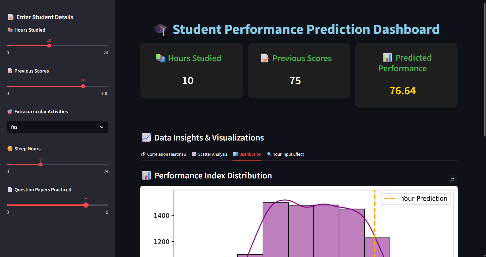
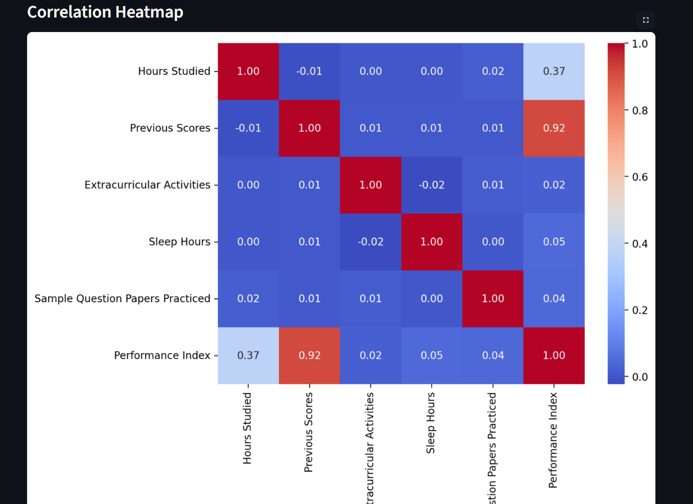
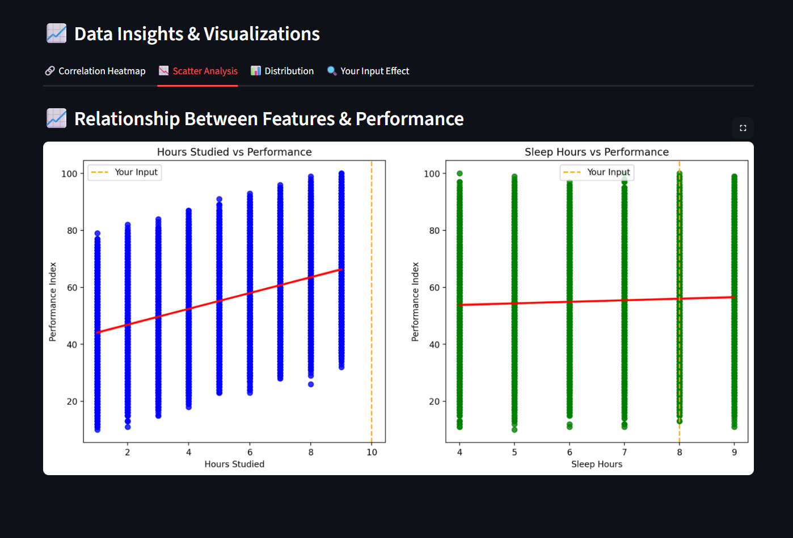
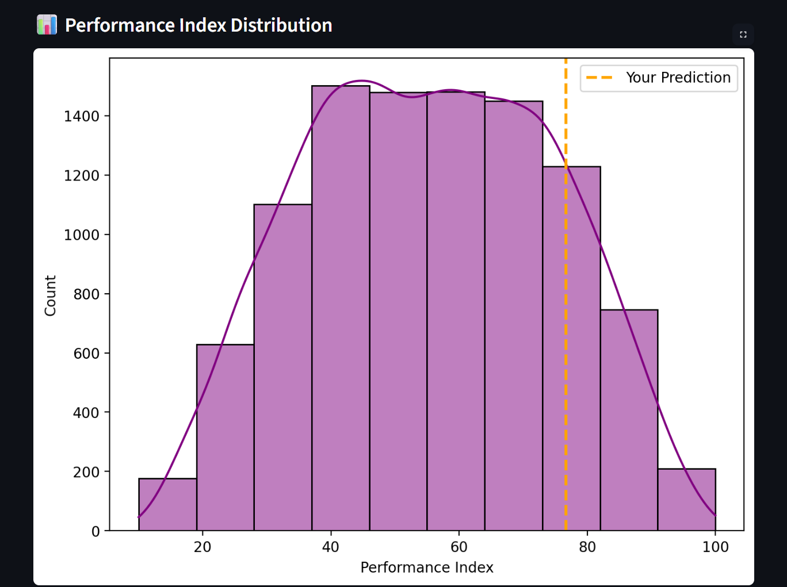
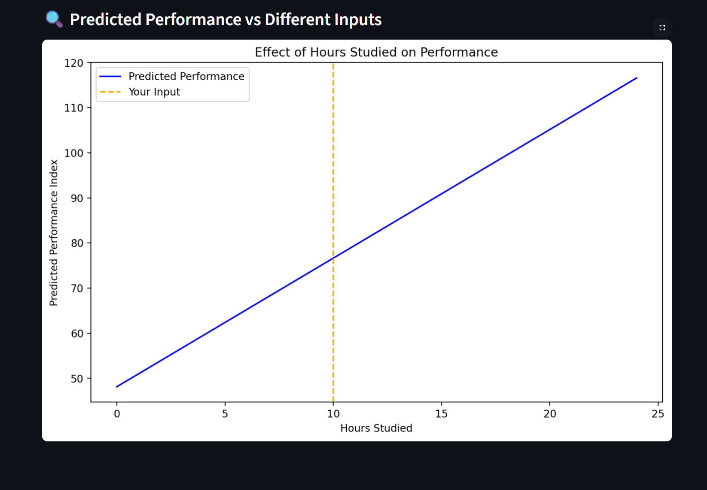

# Project Title

A simple and interactive web application built with Streamlit that predicts a student’s performance index based on study hours, previous scores, and extracurricular activities.


## Features

● 📊 Predict student performance using Machine Learning

●   🎨 Clean and modern UI with custom styling

● ⚡ Real-time input using sliders and dropdowns

●  📈 Visual representation of prediction results

● 💾 Pre-trained ML model (Joblib) integrated

## 📸 Screenshots  

## 📸 Screenshots  

### Homepage  
  

### Prediction Page  
  

### Sliders Input  
  

### Correlation Heatmap  
  

### Scatter Analysis  
  

### Distribution  
  

### Inputs Effect  
  


## ⚙️ Installation

1. **Clone the repository**  

```bash
  git clone https://github.com/ahmadraja45517/Student-Performance-Predictor
  cd Student-Performance-Predictor

```
2. **Install dependencies**

pip install -r requirements.txt

## Run Locally

**Clone the project**

```bash
  git https://github.com/ahmadraja45517/Student-Performance-Predictor
```

**Go to the project directory**

```bash
  cd Student-Performance-Predictor
```

**Install dependencies**

```bash
  pip install -r requirements.txt
```

**Start the server**

```bash
  streamlit run app.py
```


## 🛠 Usage / Examples

1. **Run the Streamlit app:**
```bash
streamlit run app.py
```
2. **Open the URL shown in the terminal (usually http://localhost:8501) in your browser.**

3. **Adjust the sliders for:**

- Hours Studied

- Previous Scores

- Extracurricular Activities

- Sleep Hours

- Question Papers Practiced

## 🧑‍💻Tech Stack

### Technologies Used

- **Python** – Core programming language
- **Streamlit** – User Interface / Web app
- **Pandas** – Data handling and manipulation
- **Scikit-learn** – Model training and prediction
- **Joblib** – Model serialization
- **Matplotlib** – Data visualization
- **Seaborn** – Statistical data visualization


## License

[MIT](https://choosealicense.com/licenses/mit/)


## 🙏 Acknowledgements

***Dataset*** inspired from student performance studies

***Scikit-learn***
 for machine learning model building

***Streamlit***
 for fast and interactive app deployment

***Matplotlib
 and Seaborn***
 for data visualization

Inspiration from ***open-source ML projects*** and research on student performance analysis

